# 合肥幻联科技有限公司产品手册 2026

> PDF提取结果 | 共 18 页 | 提取 107 张图片

---

## 第 1 页

### 文本内容

幻联科技公众号
联系我们
幻联科技
合肥幻联科技有限公司
以脑引智 联动未来
以脑引智 联动未来
Pioneering the Future
18656081001
35745809@qq.com
安徽省合肥市蜀山区潜山路888号百利中心南塔3楼318室
Pioneering the Future
从神经信号到意图解码：全栈脑机接口系统与科研服务

### 图片 (4 张)

<small>尺寸: 598x479 | xref: 781</small>

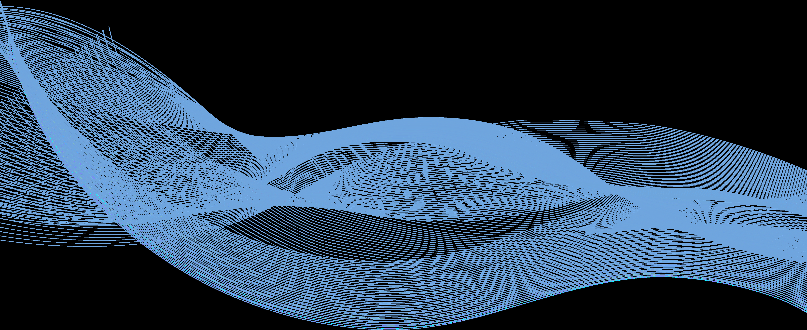

<small>尺寸: 4900x2005 | xref: 782</small>

<small>尺寸: 503x1104 | xref: 783</small>

<small>尺寸: 258x258 | xref: 784</small>

---

## 第 2 页

### 文本内容

合肥幻联科技有限公司是国内专注于侵入式脑机接口系统研发
与产业化的高科技企业，核心业务涵盖高端植入式电极、高通量神
经信号采集设备的研发、生产及配套科研技术服务，为神经科学研
究提供自主可控的全栈式解决方案。
       公司核心团队覆盖材料科学、微纳加工、芯片设计、神经电生
理及算法开发等关键领域，已掌握可溶性神经介质材料、硅基探针
微纳加工、高频信号采集算法等核心技术，是安徽省内领先的侵入
式脑机接口高科技企业。
       产品矩阵包括2048通道NeuroBox采集系统、密歇根硅基电
极、ECoG柔性皮层电极、微丝电极及高密度微电极阵列，适配基础
科研、光遗传联用、长期在体记录等场景，已服务于海内外多家科
研机构。
       公司以“推动脑科学研究普及、助力国产脑机接口技术落地”
为使命，持续为用户提供稳定可靠的设备与全程技术支持。
引领脑机接口领域的开拓者

### 图片 (1 张)

<small>尺寸: 996x798 | xref: 793</small>

---

## 第 3 页

### 文本内容

目录
产品与服务
01
在体神经电生理整体解决方案
03
密歇根硅基电极
05
微丝电极
ECoG柔性电极
09
07
NeuroBox高通量神经信号采集系统
NeuroAnalysis神经信号记录分析软件
H-Headstage及专用连接线缆
10
12
12
13
16
核心电极系统
信号采集与定位系统
离体脑机超高密度微电极阵列
生态伙伴

---

## 第 4 页

### 文本内容

密歇根硅基电极
NeuroBox
高通量神经信号采集系统
PRODUCTS & SERVICES
产品与服务
植入式脑机接口
整体解决方案
ECoG柔性电极
MPM多臂脑图谱定位智能植入系统
临床试验
临床试验(癫痫、渐冻症等)
模拟动物实验
神经功能读取
神经活动监测
神经活动调控
VR系统
NeuroAnalysis神经信号记录分析软件
光遗传、电刺激
光遗传、电刺激
认知训练、行为追踪、虚拟现实
01
02

### 图片 (16 张)

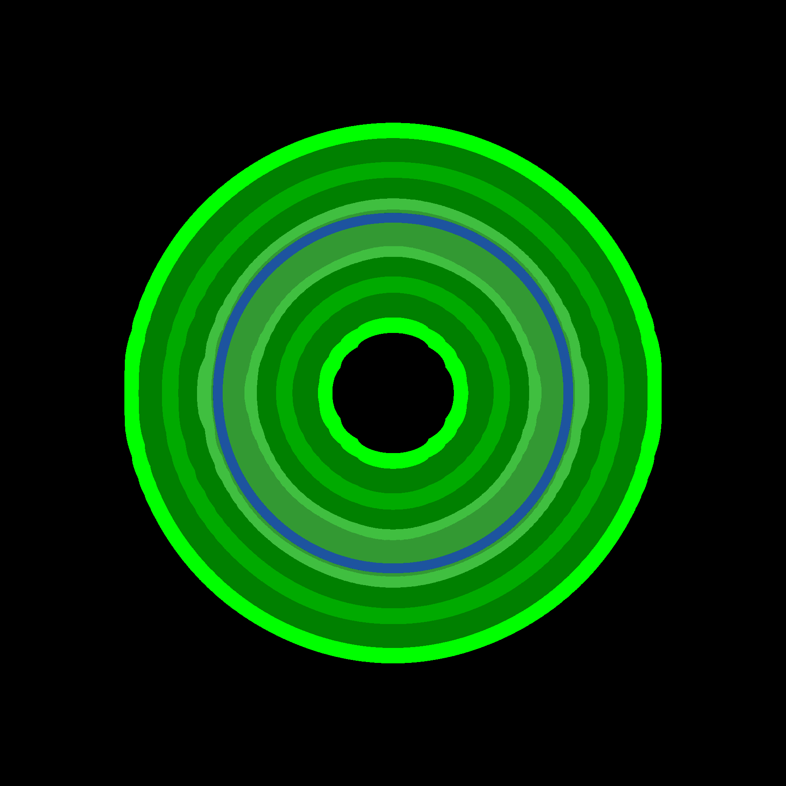

<small>尺寸: 1839x1839 | xref: 809</small>

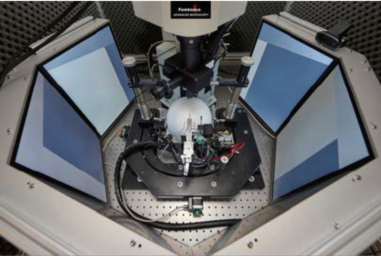

<small>尺寸: 381x256 | xref: 810</small>

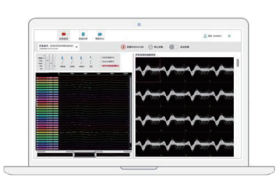

<small>尺寸: 452x302 | xref: 811</small>

<small>尺寸: 598x479 | xref: 812</small>

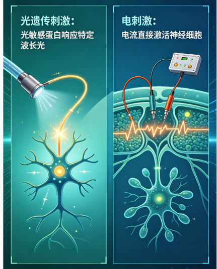

<small>尺寸: 431x536 | xref: 813</small>

<small>尺寸: 985x397 | xref: 814</small>

<small>尺寸: 981x684 | xref: 815</small>

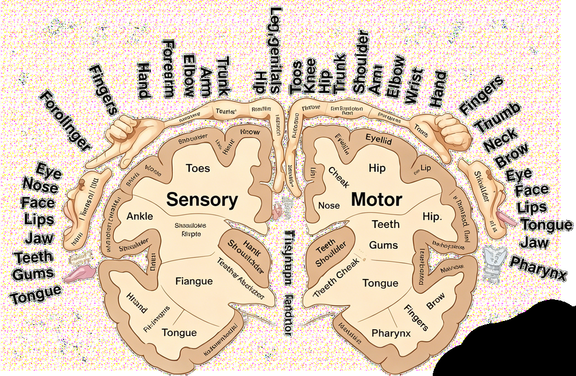

<small>尺寸: 981x642 | xref: 816</small>

<small>尺寸: 931x514 | xref: 817</small>

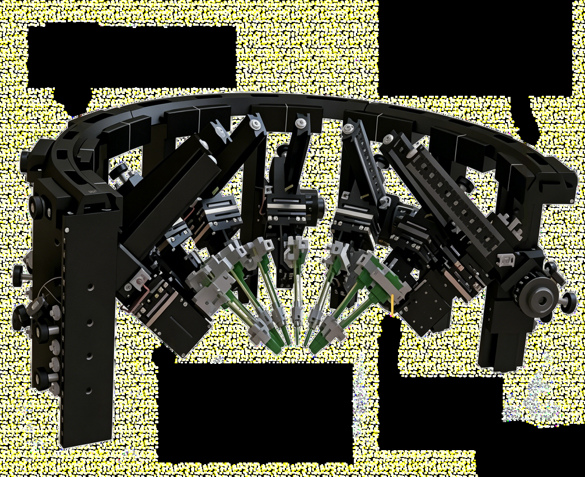

<small>尺寸: 1045x852 | xref: 818</small>

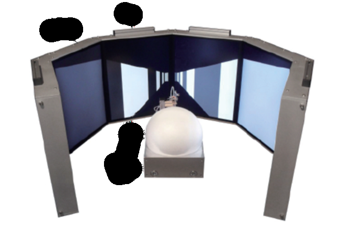

<small>尺寸: 663x453 | xref: 819</small>

<small>尺寸: 1008x562 | xref: 820</small>

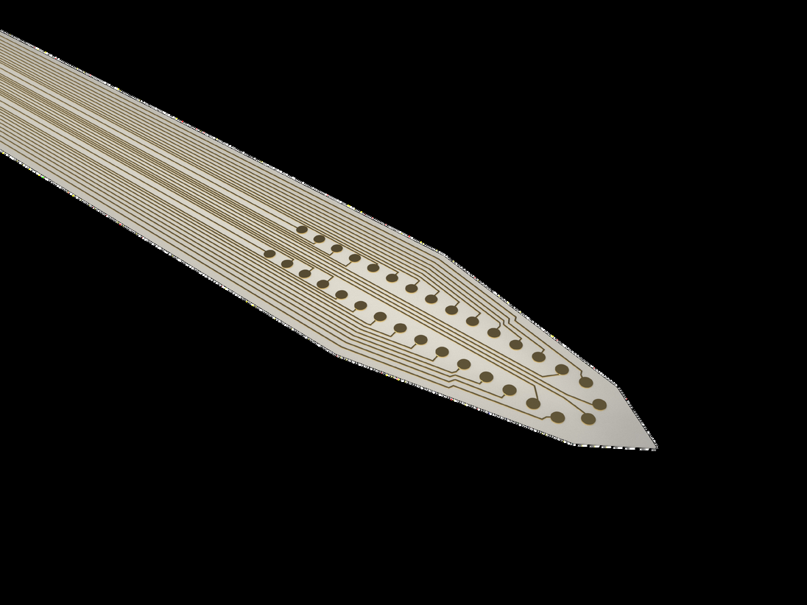

<small>尺寸: 1096x822 | xref: 822</small>

<small>尺寸: 1536x1057 | xref: 824</small>

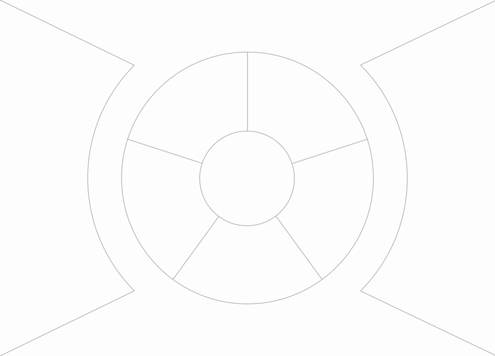

<small>尺寸: 2280x1640 | xref: 1516</small>

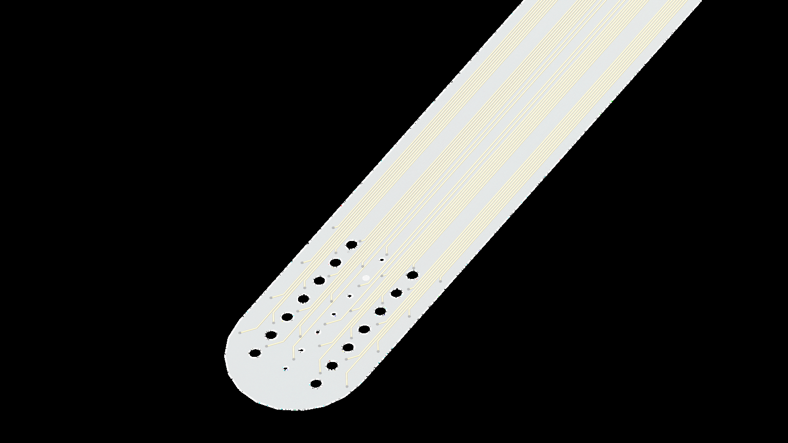

<small>尺寸: 1536x864 | xref: 1527</small>

---

## 第 5 页

### 文本内容

幻联科技在体神经电生理整体解决方案，依托密歇根硅基电极、ECoG柔性
电极、微丝电极、NeuroBox高通量神经信号采集系统、MPM多臂脑图谱定位智
能植入系统、VR系统与NeuroAnalysis神经信号记录分析软件几大核心产品，
构建从电极植入、信号采集到数据分析的全流程闭环。方案兼具高可靠性、微
创化、智能化与定制化优势，适配动物实验与临床前研究场景，可显著提升神
经科学研究与临床诊疗的效率与质量。
在体神经电生理整体解决方案
Overall Solution for In Vivo Neuroelectrophysiology
密歇根硅基电极
ECoG柔性电极
微丝电极
03
04

### 图片 (5 张)

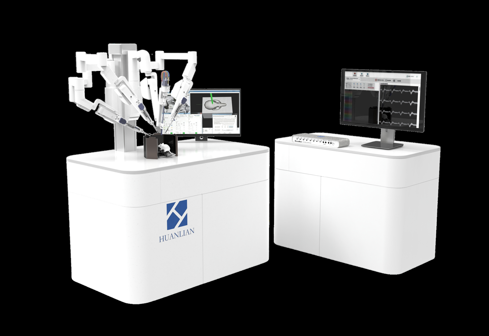

<small>尺寸: 3812x2623 | xref: 829</small>

<small>尺寸: 1440x802 | xref: 830</small>

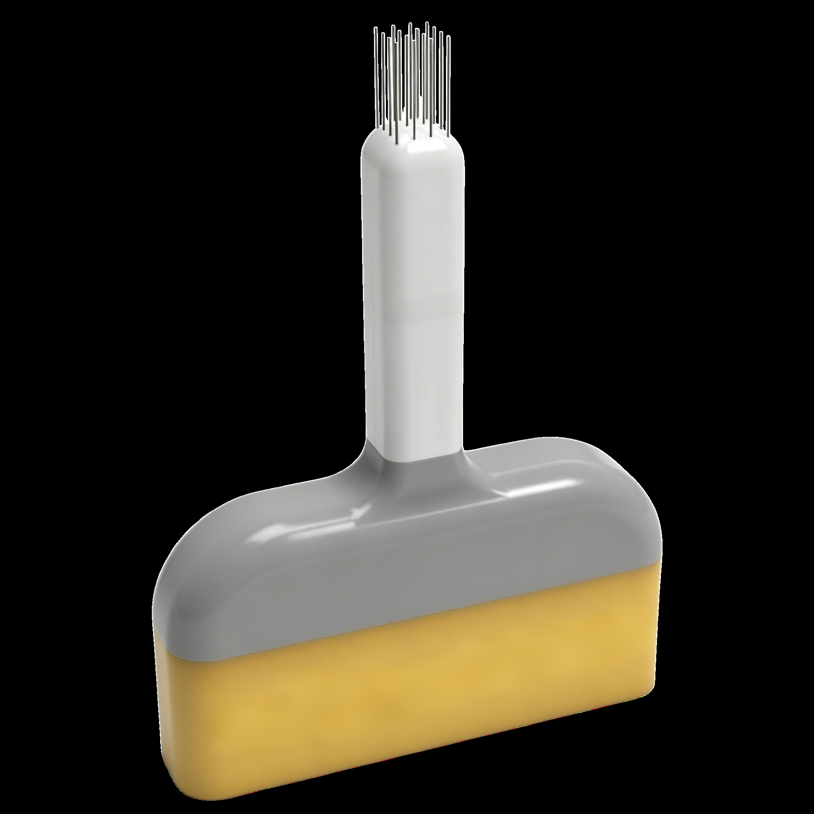

<small>尺寸: 2048x2048 | xref: 834</small>

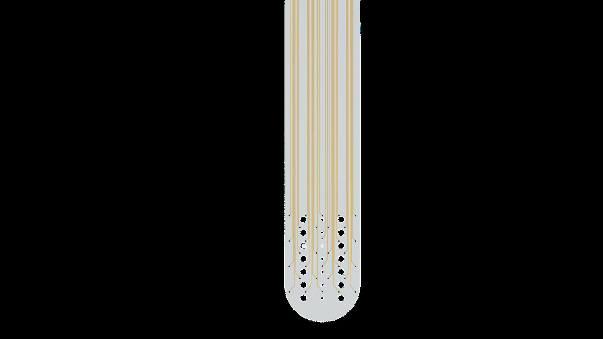

<small>尺寸: 2304x1296 | xref: 835</small>

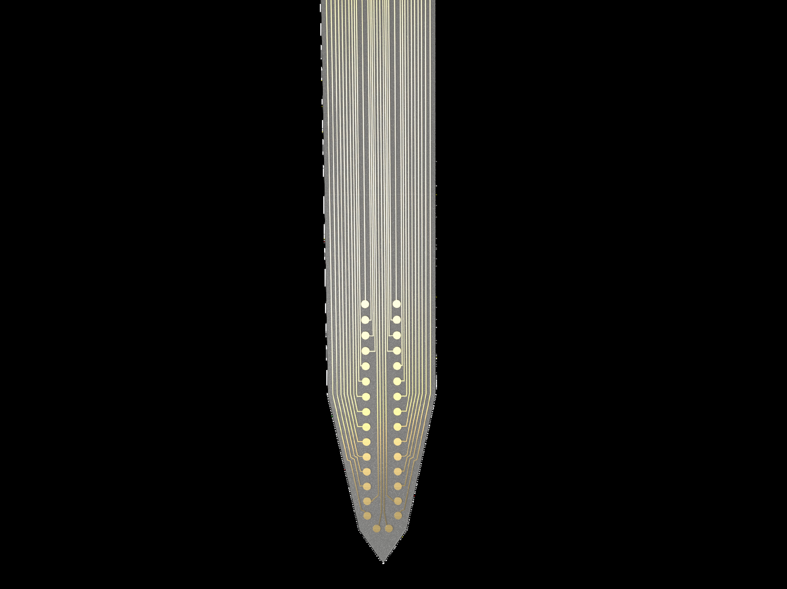

<small>尺寸: 1826x1369 | xref: 836</small>

---

## 第 6 页

### 文本内容

动物行为学分析
神经科学基础研究
精神类疾病机理探索
运动功能康复
语言解码
感觉功能重建
产品优势
依托先进半导体微纳加工工艺，实现
单根电极32~256 通道的灵活定制，
触点密度可达每平方毫米数百个。
采用生物相容性高纯单晶硅基底，无
细胞毒性、无免疫原性，生物相容性
优异，长期植入安全。
采用微米级尖峰设计，插入阻力低、
定位精准，可大幅降低脑组织物理损
伤与炎症反应风险。
全流程自动化标准化微纳加工生产，
批次一致性高，确保跨实验室、跨批
次实验结果的可重复性。
密歇根硅基电极
适用研究领域
高密度多通道覆盖
微创低损伤植入
尖峰设计，微创低损伤
工艺稳定可靠
密歇根硅基电极以硅基材料为基底，采用微纳
加工工艺制备，可实现高密度电极触点阵列，
通道数覆盖32~256通道，适用于大脑不同深
度区域的神经信号精准采集。电极采用超薄针
体设计，可显著降低脑组织损伤；可兼容光遗
传技术，用于稳定记录深部脑区峰电位
(Spike)与局部场电位(LFP)，满足高精度、多
通道、长期稳定的在体电生理记录需求。
有效针体长度：
3/6/9/15mm
支持个性化定制
厚度：15 μm
支持个性化定制
急性电极
慢性电极
05

### 图片 (2 张)

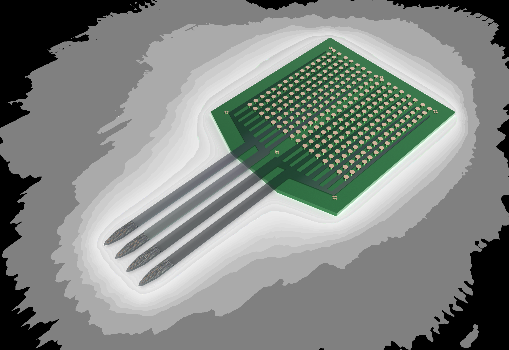

<small>尺寸: 2304x1586 | xref: 852</small>

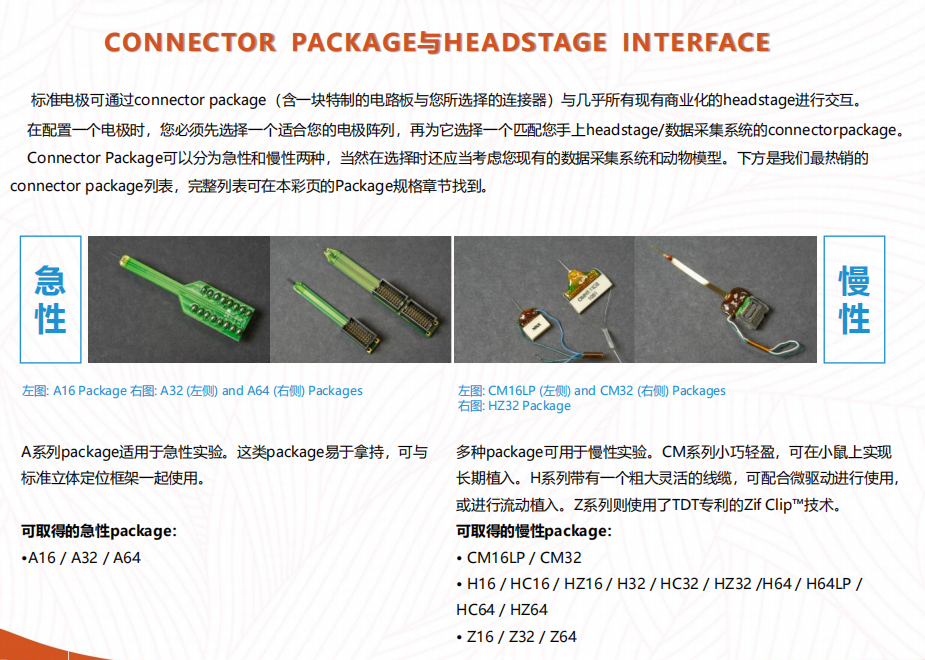

<small>尺寸: 925x660 | xref: 854</small>

---

## 第 7 页

### 文本内容

应用场景
动物行为学分析
运动功能康复
神经科学基础研究
语言解码
精神类疾病机理探索
感觉功能重建
20 μm
生物亲和材质
长期植入稳定可靠
标品长度
3/6/9/15mm
柄长可定制
尖峰设计，微创低损伤
70~150 μm
32、 64、 128、 256
阻抗
50~100 kΩ
参数
柄长
柄厚
柄数
位点尺寸
规格
3/6/9/15mm
15 μm
32(单柄)、64(双柄）
128(四柄)、256(四柄)
20 μm
通道数
光遗传兼容性
材料
支持定制化需求
位点尺寸、电极数量、针体长
度、阵列排布、封装形式
06
、
3N4
Si、SiO
、
2
Si
Au 、IrOx

### 图片 (7 张)

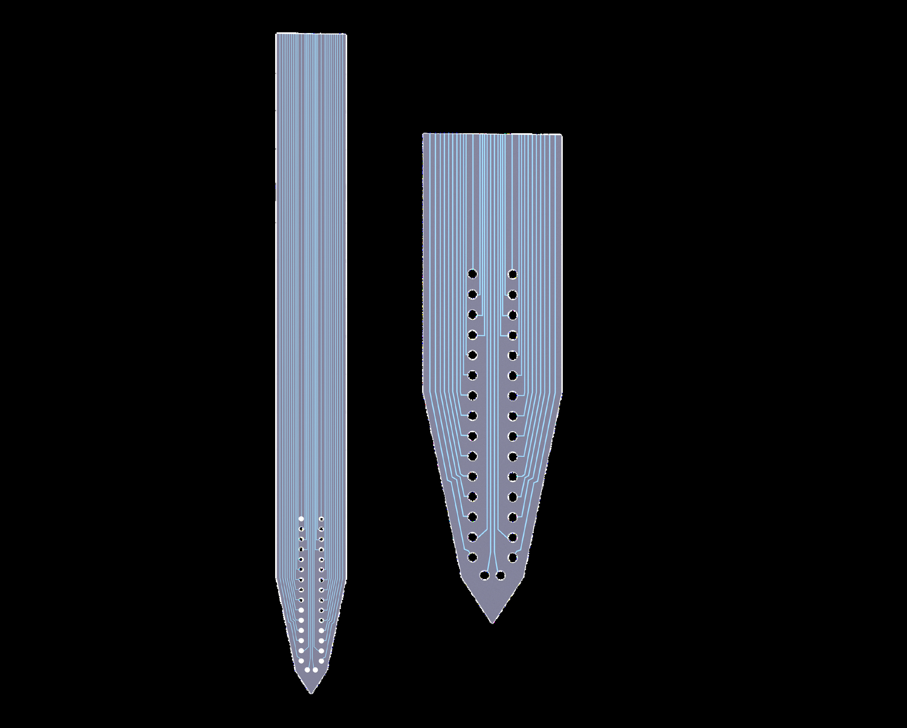

<small>尺寸: 2469x1984 | xref: 861</small>

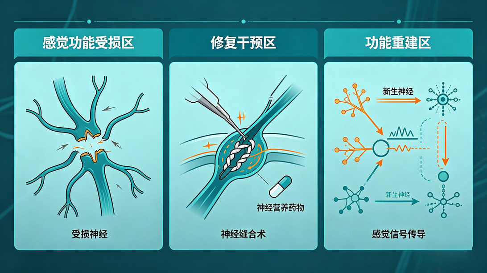

<small>尺寸: 1092x614 | xref: 863</small>

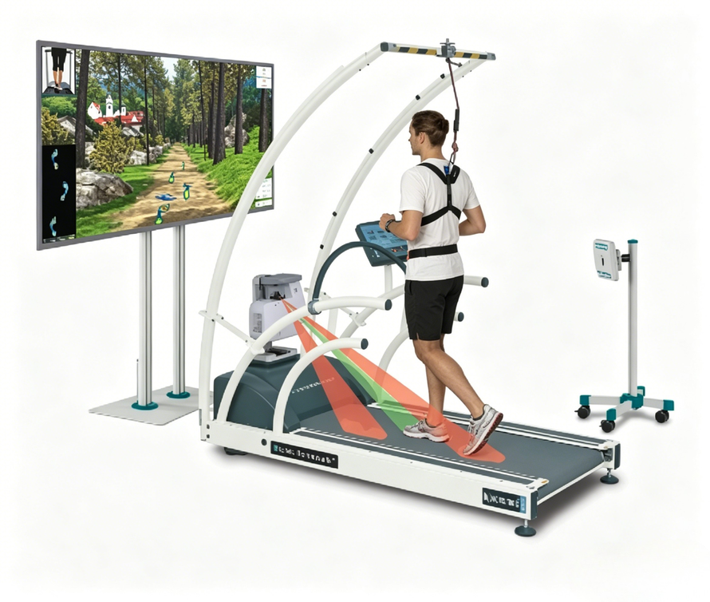

<small>尺寸: 890x754 | xref: 864</small>

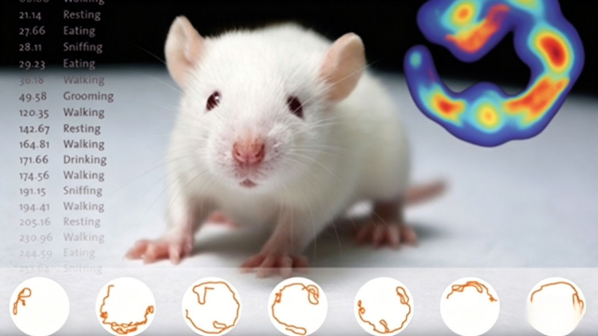

<small>尺寸: 1092x615 | xref: 865</small>

<small>尺寸: 715x426 | xref: 866</small>

<small>尺寸: 648x486 | xref: 867</small>

<small>尺寸: 1064x631 | xref: 868</small>

---

## 第 8 页

### 文本内容

非人灵长类(如猕猴)
脑机接口
哺乳类(猫、狗、貂)
感官研究：痛觉、视觉、听觉等
啮齿类(大鼠、小鼠)
高级认知研究：学习、记忆、决策等
鸟类(鸽子)
疾病机理研究：癫痫、帕金森等
药物机理研究
高通量
高性能
多系统适配
支持32/64/128多通道配置，在扩大信号采集
覆盖范围的同时，有效提升信号质量与生物相
容性。
电极厚度最薄仅5 μm，柔性贴合性能优异，可
长期稳定追踪同一神经元，持续采集高精度神
经信号。
具备优异的兼容特性，可完美适配本公司自研设备及全球主流品牌的神经信号采集系统，与各类设
备平台实现无缝对接。
ECoG柔性电极
ECoG柔性电极适合长期跟踪神经元的LFP
信号，在疾病机制、记忆认知等研究方向相
对于刚性电极优势非常明显。该皮层电极与
脑组织贴合度高、信号稳定性强，可实现大
范围多脑区脑皮层电信号(ECoG)观测。
研究对象
适用研究领域
产品优势
厚度：5 μm
07

### 图片 (1 张)

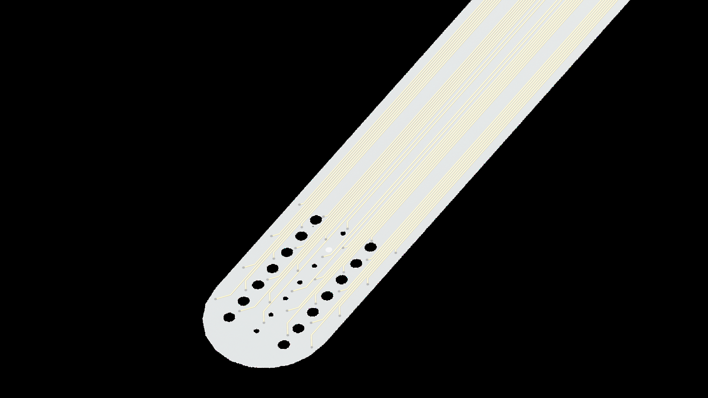

<small>尺寸: 3072x1728 | xref: 1737</small>

---

## 第 9 页

### 文本内容

参数
电极数量
长度
厚度
位点直径
阻抗
50~100 kΩ
开孔
材料
支持定制化需求
独特开孔设计
科学贴合大脑
位点尺寸、电极数量、长度、
阵列排布、封装形式
规格
32、64、128
15mm
5 μm
40 μm
100 μm(小)
200 μm(大)
Pi、Au 、I O
r
x
应用场景
运动控制
闭环神经调控
语言交流
癫痫监测与定位
感觉反馈
术中功能区定位
2800 μm
15mm
200 μm
40 μm
100 μm
08

### 图片 (7 张)

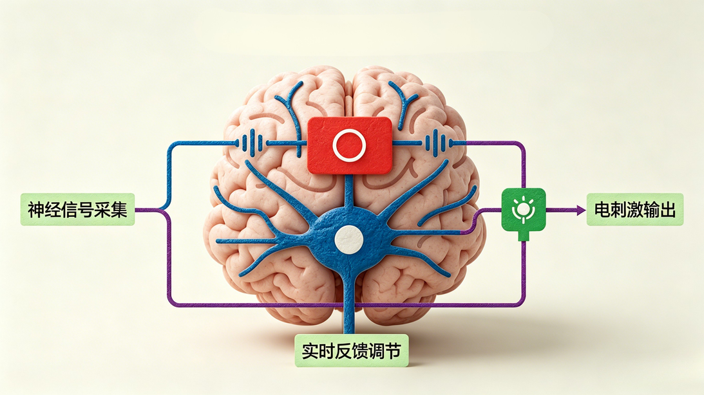

<small>尺寸: 1093x614 | xref: 926</small>

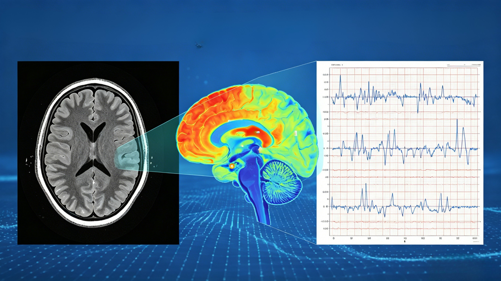

<small>尺寸: 1093x614 | xref: 927</small>

<small>尺寸: 1093x614 | xref: 928</small>

<small>尺寸: 1377x761 | xref: 929</small>

<small>尺寸: 498x332 | xref: 930</small>

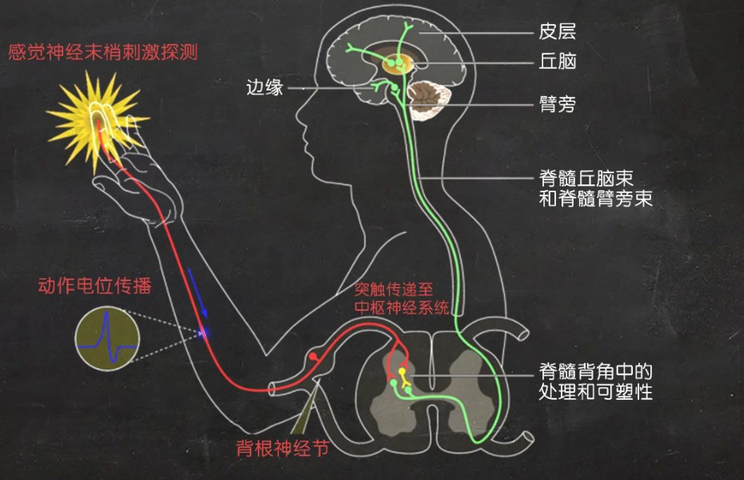

<small>尺寸: 744x480 | xref: 931</small>

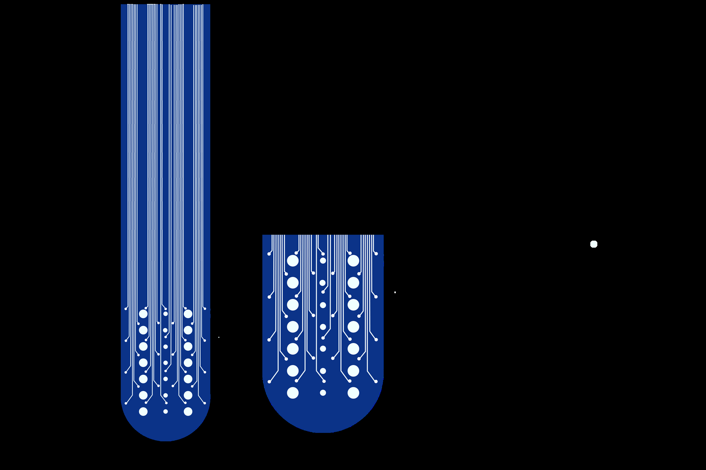

<small>尺寸: 2508x1672 | xref: 932</small>

---

## 第 10 页

### 文本内容

微丝电极
微丝电极由纤细电极丝精密排列组装而成，
电极丝表面覆有生物相容性涂层，触点采用
机械切断工艺制备。电极丝质地纤细柔韧，
以聚乙二醇(PEG) 封装固定，仅露出约
2~14mm电极丝用于穿刺植入；植入过程
中，固化的聚乙二醇可被水体逐步溶解，保
证电极丝精准垂直刺入目标脑区。该阵列可
有效记录峰电位(Spike) 与局部场电位
(LFP)，同时支持微电流刺激相关实验。
动物行为学分析
神经科学基础研究
精神类疾病机理探索
运动功能康复
语言解码
感觉功能重建
适用研究领域
参数
通道数
间距
丝长
接头
规格
32、64、128
200 μm
2~14mm
Samtec16 pin 
Match Omnetics16 pin
Match Omnetics32 pin
Match Omnetics36 pin
材料
支持丝长定制化需求
25 μm镍钛丝、钨丝
非人灵(如猕猴)
哺乳类(猫、狗、貂)
啮齿类(大鼠、小鼠)
鸟类(鸽子)
研究对象
2~14mm
09

### 图片 (1 张)

<small>尺寸: 2048x2048 | xref: 939</small>

---

## 第 11 页

### 文本内容

非人灵长类(如猕猴)
脑机接口
哺乳类(猫、狗、貂)
感官研究：痛觉、视觉、听觉等
啮齿类(大、小鼠)
高级认知研究：学习、记忆、决策等
两栖类(蛙)
昆虫类(果蝇)
疾病机理研究：癫痫、帕金森等
药物机理研究
研究对象
适用研究领域
NeuroBox高通量神经信号采集系统
本产品以硅基材料为基底，采用微纳加工工艺制备，可实现高密度电极触点阵列，通道
数覆盖32~256通道，适用于大脑不同深度区域的神经信号精准采集。电极采用超薄针
体设计，可显著降低脑组织损伤；可兼容光遗传技术，用于稳定记录深部脑区峰电位
(Spike)与局部场电位(LFP)，满足高精度、多通道、长期稳定的在体电生理记录需求。
10

### 图片 (1 张)

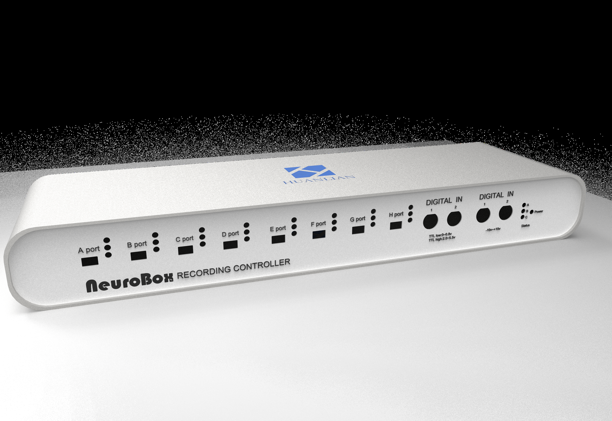

<small>尺寸: 2688x1850 | xref: 987</small>

---

## 第 12 页

### 文本内容

最高可集成 2048 通道
技术参数
ADC分辨率
模拟输入
N512
可采集512通道神经信号
通道数
采样率
参数
模拟输出
数字输入
电极信号输入端口
数据传输接口
供电方式
音频接口
信号输入范围
512~2048
规格
2通道（TTL）
2通道（±10 V)
2通道（±10 V)
电源适配器、5V DC
0~30 kHz
8路
±5.0 mV
16 bit
3.5mm音频接口
N1024
可采集1024通道神经信号
N2048
可采集2048通道神经信号
产品型号
A
B
C
Power
Status
-10v~+10v
A port
E port
C port
G port
B port
F port
D port
H port
TTL low：0~0.8v
TTL high：2.0~5.5v
DIGITAL IN
DIGITAL IN
1
1
2
2
128/256通道*
128/256通道*
128/256通道*
128/256通道*
*单模块配置
11
USB 3.0(Type-C)

### 图片 (4 张)

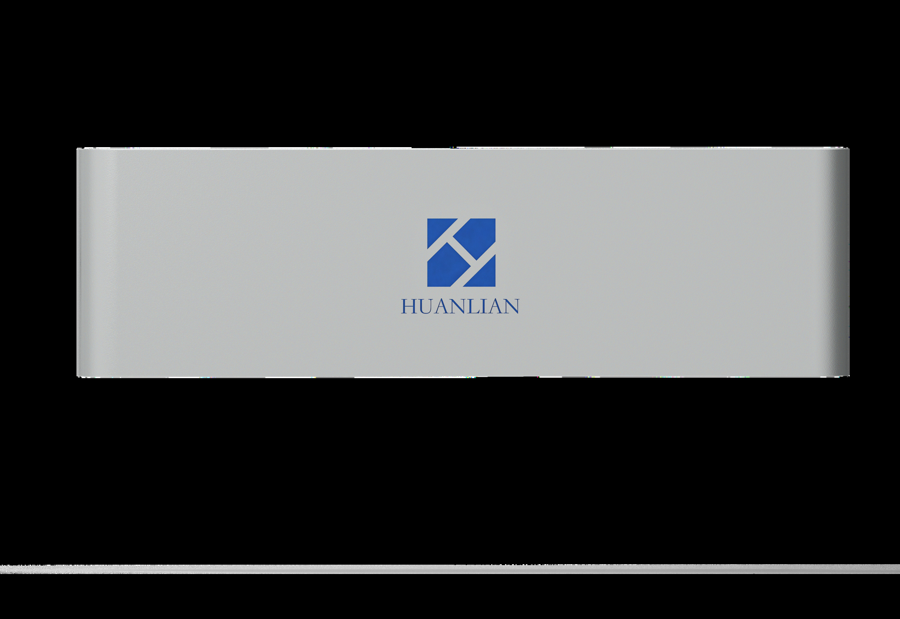

<small>尺寸: 1920x1321 | xref: 1017</small>

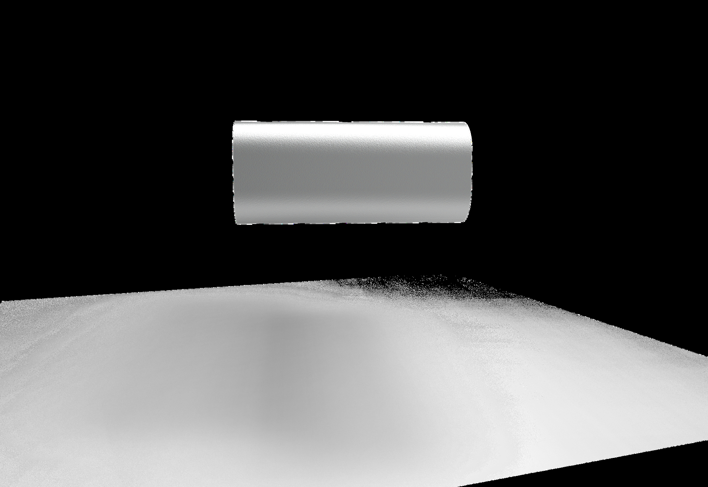

<small>尺寸: 1920x1321 | xref: 1018</small>

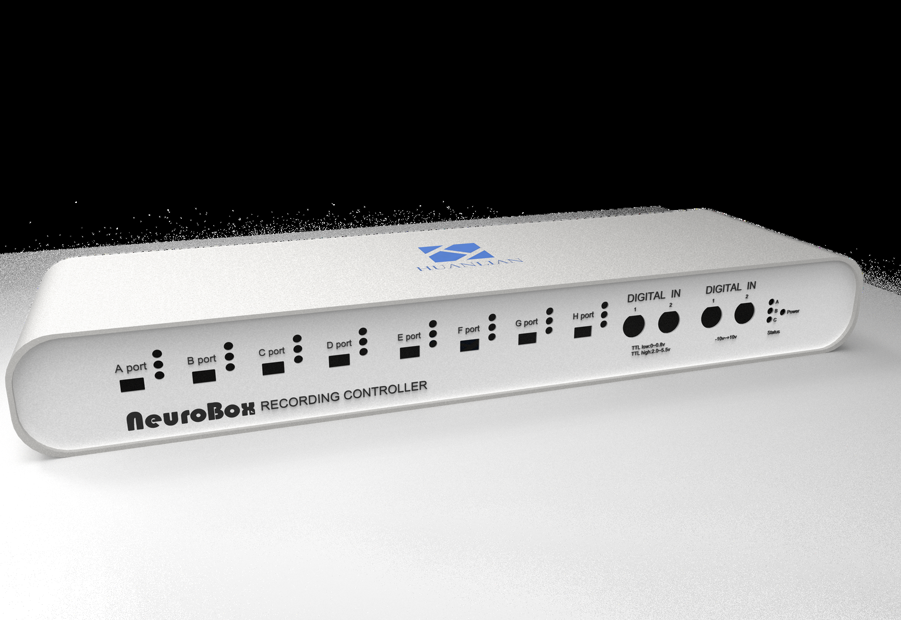

<small>尺寸: 1536x1057 | xref: 1019</small>

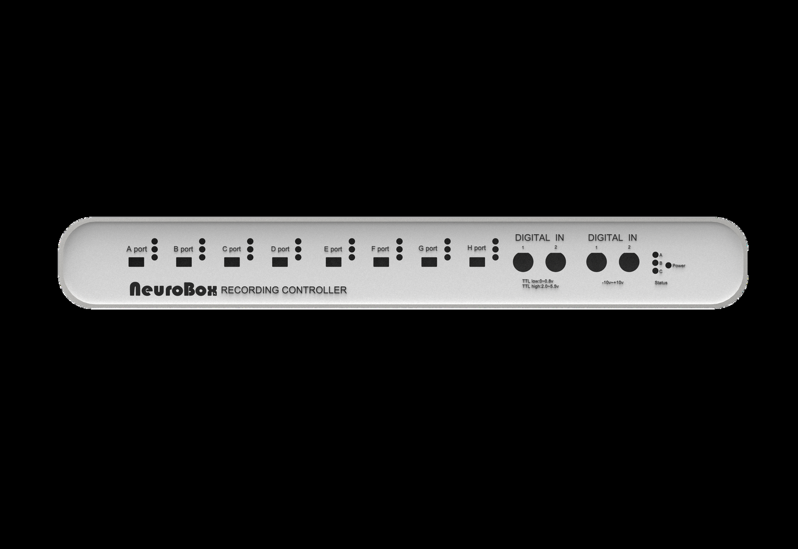

<small>尺寸: 1536x1057 | xref: 1020</small>

---

## 第 13 页

### 文本内容

通道数
前放输入
电极连接器
数据线缆连接器
32/64通道
32/64通道单极输入
Omnetics-36pin连接器
线径
线长
Headstage端接口
主机端接口
Type-C(USB 3.0)
1.80±0.20 
0.5-5 m（可定制）
12 pin专用数据接口
12 pin SPI高速数据接口
Headstage
NeuroAnalysis神经信号记录分析软件
Headstage专用连接线
幻联科技自主开发的神经信号记录分析软件(NeuroAnalysis)支持实时查看所有通道的
神经信号波形，并以二进制格式存储数据。软件可在线配置采样率 (0–30 kHz)，实时
调整芯片带宽，测量并显示各通道电极阻抗；同时支持高通量神经信号一键分选、峰
电位与事件相关分析等多种数据处理功能。
Headstage专用连接线为Headstage前端放大器
专用定制线，用于串行数字信号传输，默认线长2
米。
Headstage是专为神经信号采集设计的前置放大器，支
持32/64通道输入，配备标准电极接口与高速数据接口，
可稳定传输并预处理神经信号，无缝对接采集系统。
12

### 图片 (3 张)

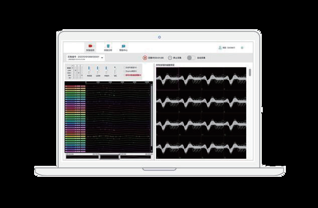

<small>尺寸: 634x414 | xref: 2009</small>

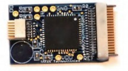

<small>尺寸: 216x120 | xref: 2012</small>

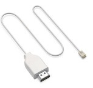

<small>尺寸: 153x145 | xref: 2015</small>

---

## 第 14 页

### 文本内容

适用性高
可重复性好
数据检测质量高
高灵敏性
数据完整性
支持长期实验
细胞活动复杂动态变化的记录，是表型表征、疾病
建模与药物研发的核心环节。随着体外细胞与组织
模型的快速发展，科研领域对可在同一样本中同步
实现细胞功能、发育、连接及形态分析的实时、无
标记检测技术需求持续增长。高密度微电极阵列在
非侵入式体外细胞功能检测领域具备无可比拟的技
术优势。
核心性能参数
超高密度配置：单孔22400Pt-电极
超高空间分辨率：3265电极/立方毫米
超低噪音水平：精准捕捉微弱电信号，保障数据可靠性
灵活刺激方案：支持任意电极点独立电刺激
多尺度信息采集能力
网络层面：实时捕捉神经网络整体活动动态
细胞层面：高分辨率记录单个神经元电活动特征
亚细胞层面：解析突触级、微区电信号变化
主要优点
高密度微电极阵列的技术优势
传统MEA电极尺寸大、间距远，仅能检测样本中的部分神经元，记录的信号实为多个神经元
放电的叠加总和。HD-MEAs凭借独特的超高分辨率与低噪声特性，阵列中每个神经元的
Spike信号(包括沿轴突传播的动作电位)均可被多个紧密相邻的电极同时采集。因此，
HuanLian HD-MEAs可提供卓越的数据质量，既能捕捉复杂的神经网络动态，也能精准识
别单个神经元的功能特征。
产品优势
离体脑机超高密度微电极阵列
(HD-MEAs)
13

### 图片 (4 张)

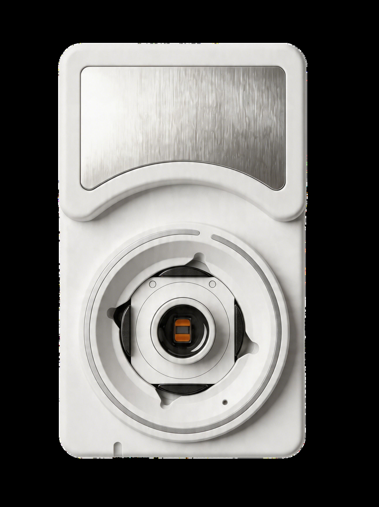

<small>尺寸: 1037x1383 | xref: 1067</small>

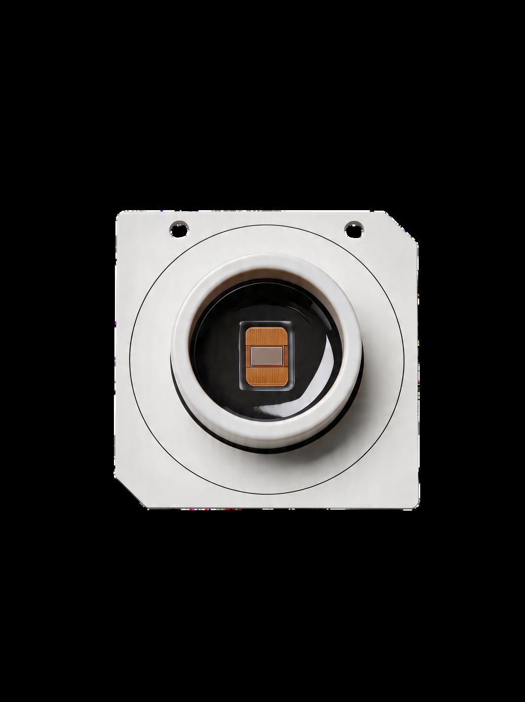

<small>尺寸: 1037x1383 | xref: 1068</small>

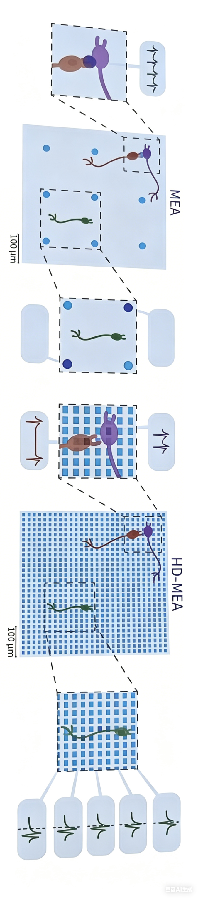

<small>尺寸: 675x3045 | xref: 1078</small>

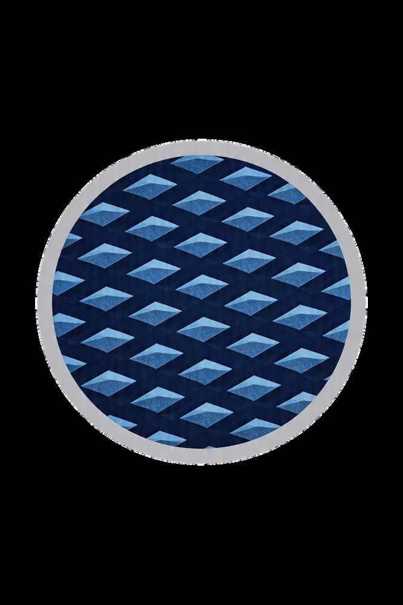

<small>尺寸: 666x999 | xref: 2056</small>

---

## 第 15 页

### 文本内容

实例应用
技术参数
类器官/神经球
其他应用
脑组织
孔径
PSM
PLM
PDMS 应用
内径19mm、外径24mm
内径32mm、外径35mm
内径19mm、外径24 mm
培养样本
急性样本
器官样本
8mm
8mm
8mm
3.85×2.10mm
3.85×2.10mm
3.85×2.10mm
2
2
2
26,400
26,400
26,400
26,400
26,400
26,400
2
3,265电极/mm
2
3,265电极/mm
2
3,265电极/mm
17.5 μm
2
8.75×12.50 μm
2
8.75×12.50 μm
2
10.0×10.0 μm
17.5 μm
17.5 μm
*铂金
*铂金
*铂金
<2.0 μm
<2.0 μm
<0.3 μm
20 kHz/通道
20 kHz/通道
20 kHz/通道
1,020
1,020
1,020
支持
支持
支持
支持
支持
支持
32
32
32
±1.0V
±1.0V
±1.0V
*有铂金包被
典型应用
孔高
电极区面积
电极总数量
记录/刺激电极数量
电极密度
电极中心间距
电极大小
电极材料
电极表型
采样率
记录通道的数量
增益调节
电刺激
电刺激单位数量
电刺激最大增幅
心肌细胞
体外视网膜组织
iPS 诱导神经元
支持数周至月长期稳定电生理记
录，完整追踪细胞网络功能成熟
与纵向发育全过程。
可应用于神经发育、神经退行性
疾病，及多种体外细胞组织模型
的电生理研究。
可应用于神经发育、神经退行性
疾病，及多种体外细胞组织模型
的电生理研究。
表型检测
疾病模型
神经工程
14

### 图片 (4 张)

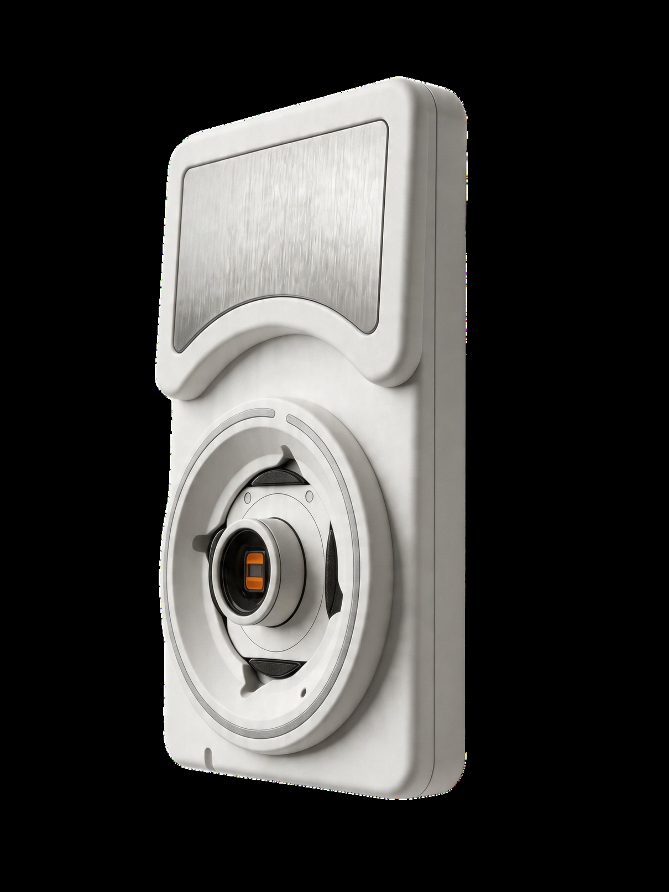

<small>尺寸: 1210x1613 | xref: 1086</small>

<small>尺寸: 615x615 | xref: 1094</small>

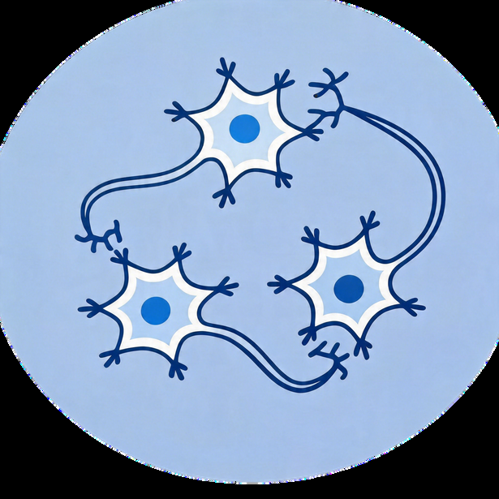

<small>尺寸: 615x615 | xref: 1113</small>

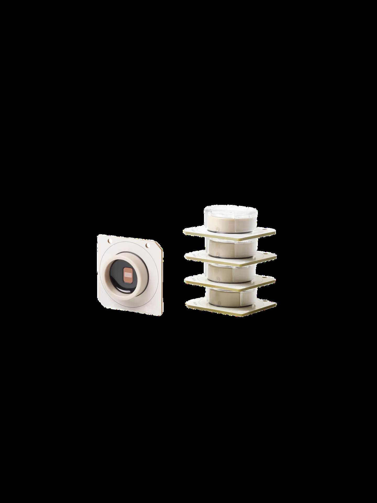

<small>尺寸: 1440x1920 | xref: 1114</small>

---

## 第 16 页

### 文本内容

片上脑机
生物计算机
片上脑机(Brain-on-a-Chip)是一种将体外培养的生物神经网络—包括原代神经元或由
干细胞分化而来的三维脑类器官—与微电极阵列芯片相耦合，从而在芯片上构建出具
备一定生物智能的“微型大脑”的前沿技术；通过编解码技术，计算机可以向这个
“微型大脑”发送刺激信号(编码)，同时实时读取其神经电生理响应(解码)，进而形成
“片上脑—计算机—外部设备”的闭环交互系统，使其能够执行避障、抓取等机器人
控制任务，并在药物筛选、神经疾病建模和类脑计算等领域展现出巨大潜力。
以脑类器官为“处理器”的生物计算机，是将人类干细胞培育的三维神经组织置于多
电极阵列上，通过电/光刺激与反馈训练，利用神经元的突触可塑性自发形成并调整连
接，实现无预编程的模式识别、任务求解等计算功能。它具备超低能耗、强并行处理
与在线持续学习的特点，被视为突破硅基计算机能效瓶颈的潜在路径。
DishBrain 系统与实验流程示意图
生物计算机的核心神经元网络显微成像
15

### 图片 (5 张)

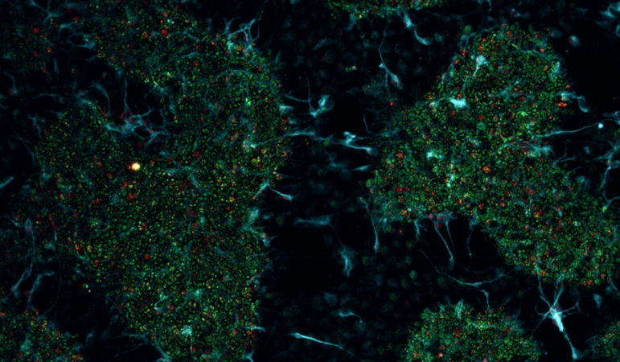

<small>尺寸: 771x450 | xref: 1204</small>

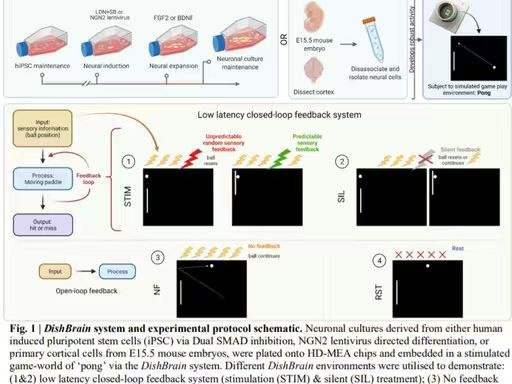

<small>尺寸: 512x384 | xref: 1205</small>

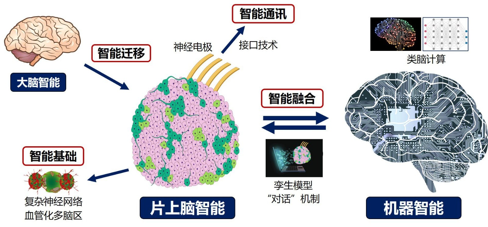

<small>尺寸: 1600x745 | xref: 1206</small>

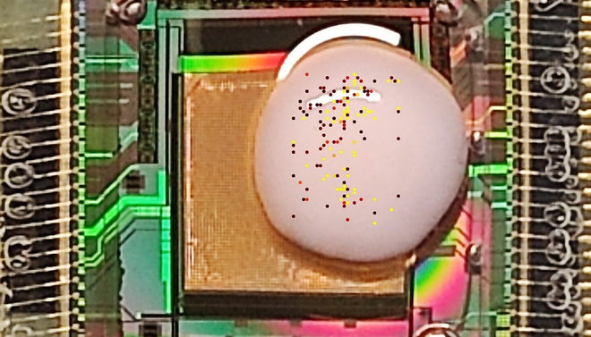

<small>尺寸: 660x377 | xref: 1207</small>

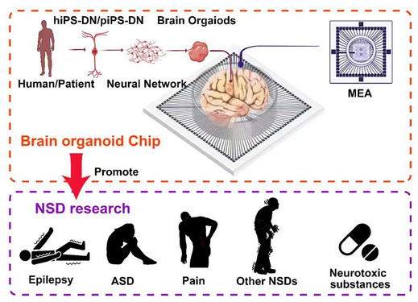

<small>尺寸: 519x375 | xref: 1208</small>

---

## 第 17 页

### 文本内容

University of Melbourne
The University of Tokyo
   Stanford University
 Massachusetts Institute  of  Technology
 Imperial College London
University of Cambridge
University of Oxford
UC Berkeley
University of Manchester
Yale University
University of Edinburgh
McGill University
University of Chicago
University of Toronto
Princeton University
国际生态伙伴
 Ecole Polytechnique Federale de Lausanne 
16

### 图片 (18 张)

<small>尺寸: 525x379 | xref: 1215</small>

<small>尺寸: 215x215 | xref: 1216</small>

<small>尺寸: 296x260 | xref: 1217</small>

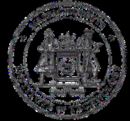

<small>尺寸: 256x239 | xref: 1218</small>

<small>尺寸: 750x228 | xref: 1219</small>

<small>尺寸: 252x310 | xref: 1221</small>

<small>尺寸: 324x380 | xref: 1222</small>

<small>尺寸: 288x343 | xref: 1223</small>

<small>尺寸: 1024x576 | xref: 1224</small>

<small>尺寸: 166x232 | xref: 1225</small>

<small>尺寸: 359x269 | xref: 1226</small>

<small>尺寸: 200x200 | xref: 1227</small>

<small>尺寸: 512x384 | xref: 1228</small>

<small>尺寸: 224x278 | xref: 1229</small>

<small>尺寸: 512x384 | xref: 1230</small>

<small>尺寸: 240x224 | xref: 1231</small>

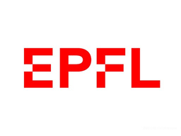

<small>尺寸: 256x192 | xref: 1232</small>

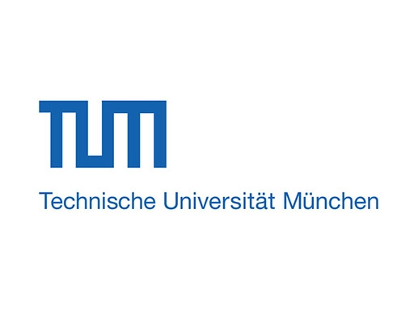

<small>尺寸: 512x384 | xref: 2441</small>

---

## 第 18 页

### 文本内容

国内生态伙伴
中国科学院脑科学与智能技术卓越创新中心
(神经科学研究所)
北京脑科学与类脑研究中心
17

### 图片 (24 张)

<small>尺寸: 237x239 | xref: 1238</small>

<small>尺寸: 233x233 | xref: 1239</small>

<small>尺寸: 938x182 | xref: 1240</small>

<small>尺寸: 710x240 | xref: 1241</small>

<small>尺寸: 691x196 | xref: 1242</small>

<small>尺寸: 478x173 | xref: 1243</small>

<small>尺寸: 756x225 | xref: 1244</small>

<small>尺寸: 353x108 | xref: 1245</small>

<small>尺寸: 604x181 | xref: 1246</small>

<small>尺寸: 521x203 | xref: 1247</small>

<small>尺寸: 769x228 | xref: 1248</small>

<small>尺寸: 413x126 | xref: 1250</small>

<small>尺寸: 720x188 | xref: 1251</small>

<small>尺寸: 587x135 | xref: 1252</small>

<small>尺寸: 439x135 | xref: 1253</small>

<small>尺寸: 418x103 | xref: 1255</small>

<small>尺寸: 873x184 | xref: 1256</small>

<small>尺寸: 606x152 | xref: 1258</small>

<small>尺寸: 701x195 | xref: 1259</small>

<small>尺寸: 522x94 | xref: 1260</small>

<small>尺寸: 791x189 | xref: 1261</small>

<small>尺寸: 560x383 | xref: 2462</small>

<small>尺寸: 607x346 | xref: 2466</small>

<small>尺寸: 478x342 | xref: 2469</small>
